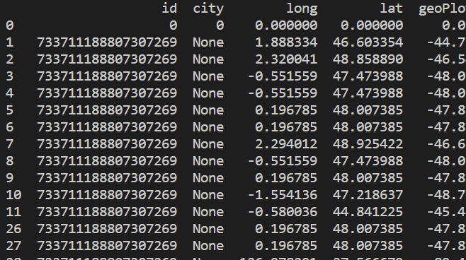

# twitterLocalisationDC

This project made in 1.5 days aims to predict the geolocation of a twitter user using only the data provided by twitter.

- prog.py - Whole code for connect API, Prediction, Generation and Visualisation.
- index.html - Map generated by Python Folium displaying the approximative geolocation.
- city.csv - Dataset for all city and country all over the world, just that. 

## References

* [Python](https://docs.python.org/3/)
* [Folium](https://python-visualization.github.io/folium/)
* [Twitter API](https://developer.twitter.com/en/docs/twitter-api/users/lookup/introduction)
* [Pandas](https://pandas.pydata.org/)
* [Geocoders](https://geopy.readthedocs.io/en/stable/)

## Manage

Install all your missing package using the command line:

```bash
pip install *package*
```

Run the code using command line:

```bash
python prog.py
```

Write the twitter id of the person you want the geolocation and wait few secondes :)
All step are in the terminal.

## Details of how it works

This project was a practice for data science and data visualisation on Folium (Leaflet) map.
First of all I add to get the data of the user targeted using twitter API.

So I got the location (if it exist) from user data.
I checked on the csv if the said location exist, if yes, the job is done.

But if there is not? no problem!
We take the followers of the target and check the location of those ones and we make a geoPlot that we can check on figures to check patterns:

geoPlot are made like this:

```bash
round(location.longitude - location.latitude, 2)
```
Then we put our datas on a Dataframe:



As we can see on the hist and the line down below.
We can see that there is pattern with a lot of people from the same geoPlot


So from this we can check if more than 50% of the followers are from around the same geoPlot.
If yes do the average of the lat and long of those followers.

Here we go we have the geolocation of the target.


## Details of how it works

 - This doesnt work with celebrities because too many followers
 - This doesnt work when no followers enought (lets say between : 30 and 2000 followers)
